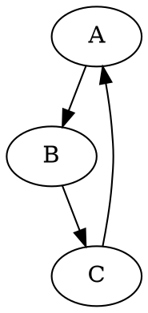
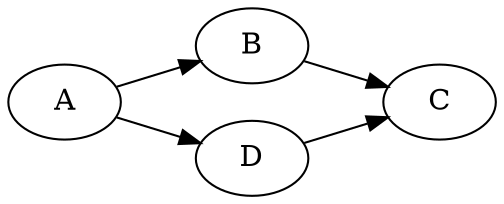
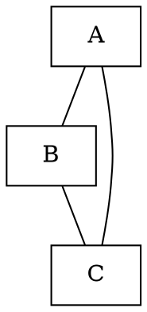
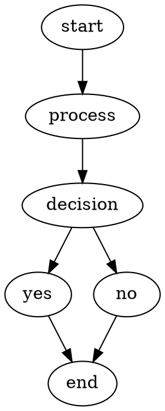
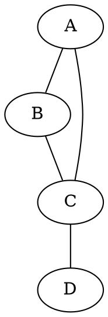

## 1. 簡介
DOT 是 Graphviz 的圖形描述語言，用於創建各種圖形（如流程圖、數據結構圖、網絡拓撲圖等）。Rust 可以透過第三方庫（如 `dot_graph` 或 `graphviz-rs`）與 DOT 語言結合，實現動態生成圖形。

---

## 2. 安裝 Graphviz
首先需要安裝 Graphviz 工具鏈，用於將 DOT 文件轉換為可視化圖像（如 PNG/SVG）。

### Linux (Ubuntu/Debian)
```bash
sudo apt-get install graphviz
```

### macOS (Homebrew)
```bash
brew install graphviz
```

### Windows
下載安裝程序：[https://graphviz.org/download/](https://graphviz.org/download/)

---

## 3. 基本 DOT 語法
DOT 文件以 `.dot` 為擴展名，基本語法如下：



- `digraph`：有向圖
- `graph`：無向圖
- `->`：有向邊
- `--`：無向邊
- `label`：節點/邊的標籤
- `color`：顏色屬性

---

## 4. Rust 中生成 DOT 文件

### 4.1 使用 `dot_graph` 庫
安裝依賴：
```toml
[dependencies]
dot_graph = "0.3"
```

#### 4.1.1 基本用法
```rust
use dot_graph::{Graph, Node, Edge, Kind};

fn main() {
	// 修正：使用 Kind::Digraph
	let mut graph = Graph::new("MyGraph", Kind::Digraph);
	// 修正：移除 with_attr，直接使用 Node::new
	let node_a = Node::new("A");
	let node_b = Node::new("B");
	graph.add_node(node_a);
	graph.add_node(node_b);
	// 修正：新增第三個參數 "Hello"
	graph.add_edge(Edge::new("A", "B", "Hello"));
	// 修正：使用 to_dot_string() 來生成 DOT 字串
	let dot_str = graph.to_dot_string().unwrap();
	println!("{}", dot_str);
	// 保存為文件
	std::fs::write("output.dot", dot_str).unwrap();
}
```

#### 4.1.2 生成圖像
在終端執行：
```bash
dot -Tpng output.dot -o output.png
```
然後用圖像查看器打開 `output.png`。

---

## 5. 高級功能

### 5.1 自動布局
Graphviz 會自動處理節點佈局，例如：


### 5.2 自定義屬性
```dot
node [shape=box, color=lightblue];
edge [color=green, label="Data Flow"];
```

### 5.3 生成控制流圖（CFG）
使用 `rustc` 的 `--emit` 選項生成控制流圖：
```bash
rustc --emit cfg your_program.rs
```
然後用 `dot` 轉換為圖像。

---

## 6. Rust 生成 DOT 的其他庫

### 6.1 `graphviz-rs`
安裝依賴：
```toml
[dependencies]
graphviz = "0.10"
```

#### 6.1.1 示例代碼
```rust
use graphviz::{Graph, Node, Edge};

fn main() {
    let mut graph = Graph::new();
    
    let node1 = Node::new("Node1");
    let node2 = Node::new("Node2");
    graph.add_node(node1);
    graph.add_node(node2);
    
    graph.add_edge(Edge::new("Node1", "Node2"));
    
    let dot_str = graph.to_string();
    println!("{}", dot_str);
}
```

---

## 7. 常見應用場景

### 7.1 數據結構視覺化


### 7.2 程式流程圖


### 7.3 網絡拓撲圖


---

## 8. 進階技巧

### 8.1 使用子圖（Subgraph）
```dot
subgraph cluster_1 {
    label = "Cluster 1";
    A -> B -> C;
}
subgraph cluster_2 {
    label = "Cluster 2";
    D -> E -> F;
}
```

### 8.2 自動排版
```dot
graph G {
    A -> B -> C;
    A -> D -> C;
    A -> E -> C;
    A -> F -> C;
}
```
使用 `dot` 會自動進行層次化排版。

---

## 9. 常見問題解決

### 9.1 图像無法顯示
- 確認 Graphviz 已正確安裝
- 檢查 DOT 文件語法（使用 `dot -Tpng file.dot -o output.png` 會顯示錯誤）

### 9.2 節點/邊標籤不顯示
- 檢查是否正確使用 `label` 屬性
- 確認 DOT 文件格式正確

---

## 10. 結語
透過 Rust 生成 DOT 文件，可以輕鬆實現圖形化視覺化。結合 Graphviz 的強大功能，能夠將複雜的數據結構、算法流程或網絡拓撲以直觀的方式呈現，有助於開發者理解和展示程式設計概念。

---

## 附錄：快速參考
| 操作 | 語法 |
|------|------|
| 有向邊 | A -> B |
| 無向邊 | A -- B |
| 節點屬性 | node [color=red]; |
| 边屬性 | edge [label="Hello"]; |
| 佈局方向 | rankdir=LR; |

希望這份教學能幫助你掌握 Rust 與 DOT 的結合應用！如需進一步了解，可以參考 [Graphviz 官方文檔](https://graphviz.org/manual/)。

